# Jointag Proximity SDK Documentation

## Table of Contents

1. [📋 Overview](#user-content--overview)
2. [📦 Installation](#user-content--installation)
    1. [Installation using CocoaPods](#user-content-installation-using-cocoapods)
    2. [Manual Installation](#user-content-manual-installation)
3. [🔐 Permissions and Settings](#user-content--permissions-and-settings)
    1. [User Tracking Permission](#user-content-user-tracking-permission)
    2. [Notifications Permission](#user-content-notifications-permission)
    3. [Location Permission](#user-content-location-permission)
4. [🚀 Setup](#user-content--setup)
    1. [Initializing the SDK](#user-content-initializing-the-sdk)
    2. [iOS 13 Scenes](#user-content-ios-13-scenes)
    3. [Handling Notifications](#user-content-handling-notifications)
5. [🔧 Advanced Configurations](#user-content--advanced-configurations)
    1. [Tracking User Identifiers](#user-content-tracking-user-identifiers)
    2. [Data Tags](#user-content-data-tags)
    3. [Programmatically Disable Advertising](#user-content-programmatically-disable-advertising)
    4. [Receive custom events](#user-content-receive-custom-events)
    5. [Notification Content Extensions](#user-content-notification-content-extensions)
6. [👤 User Consent and GDPR](#user-content--user-consent-and-gdpr)
    1. [Using a Consent Management Platform (CMP)](#user-content-using-a-consent-management-platform-cmp)
    2. [Manual Consent Management](#user-content-manual-consent-management)

---

## 📋 Overview

The Jointag Proximity SDK enables iOS applications to leverage advanced
proximity marketing capabilities with minimal integration effort.

Once integrated, the SDK operates mostly in a “start and forget” fashion: after
initialization and permission requests, it autonomously manages its lifecycle,
collecting movement and location data, and delivering targeted notifications to
the user.

What the SDK does:

- **User behavior analysis**:
  
  Tracks user movements using geofences and
Bluetooth beacons, allowing advanced segmentation and insights.
- **Proximity marketing delivery**:

  Displays location-aware notifications to the user, enabling personalized campaigns based on physical context.

What the developer needs to do:

- Add the SDK to the project (via CocoaPods or manual installation).
- Initialize the SDK with the provided API key and secret.
- Request the necessary user permissions (tracking, location, notifications).

Everything else—such as monitoring, proximity event detection, and notification
delivery—is handled automatically by the SDK.

```mermaid
flowchart TD

A[App Launch] --> B["Initialize SDK <br> with API Key & Secret"]
B --> C["Request Permissions <br>(Tracking, Location, Notifications)"]
C --> D["SDK Active ✅"]
D --> E["SDK Manages Proximity Events <br> & Notifications Automatically"]
E --> F["Optional: App uses <br> ExternalUserId / Tags / Consent"]
```



---

## 📦 Installation

The Jointag Proximity SDK is available as a compiled **xcframework** that can be
integrated into your project either via [CocoaPods](https://cocoapods.org) or
manually.

### Installation using CocoaPods

To install the Jointag Proximity SDK using CocoaPods, follow these steps:

1.  Install or update `CocoaPods` to version **1.9.0 or later**, which is
    essential for proper support of the new *xcframework* format.
2.  In your terminal execute `pod init` from your project directory, if the
    project is not already pod-enabled
3.  Edit your project Podfile and add `pod 'JTProximitySDK'` to your main
    application target
4.  In your terminal execute `pod install` from your project directory.

eg:

```ruby
target 'MyApp' do
  use_frameworks!
  pod 'JTProximitySDK'
end
```

More on [CocoaPods here](https://cocoapods.org/).

---

### Manual Installation

Jointag Proximity SDK is distribute as a compiled **xcframework** with binaries
for both device and simulator. To add it to your project, include the
*JTProximitySDK.xcframework* as follow:

1. Drag and drop the JTProximitySDK.xcframework framework folder into your Xcode
project (remember to check *"Copy items if needed"*).

2. Make sure the JTProximitySDK.xcframework appears in the **Frameworks,
Libraries, and Embedded Content** section of the **General** tab of your project
and that the *embed* mode is **Embed & Sign**

---

## 🔐 Permissions and Settings

The following section describes the permissions required by the SDK, along with
the necessary keys that must be added to the application Info.plist file.

> ⚠️ **Attention** : Starting with SDK version **1.12.0**, all the required
> permissions are no longer automatically requested when starting the SDK, but
> must be requested from the user by the application itself. To simplify this
> process, the SDK exposes helper methods to request them (such methods are
> presented below).

---

### User Tracking Permission

As described [here](user-tracking-usage-description), user tracking
permission requires the following key to be added to the application
**Info.plist** file:

```xml
<key>NSUserTrackingUsageDescription</key>
<string>User Tracking Usage Description</string>
```

A helper method is provided to easily request tracking authorization:

**Swift**

```swift
Proximity.shared.requestTrackingAuthorization()
```

**Objective-C**

```objc
[JTProximitySDK.sharedInstance requestTrackingAuthorization];
```

---

### Notifications Permission

A helper method is provided to easily request notification authorization:

**Swift**

```swift
Proximity.shared.requestNotificationAuthorization()
```

**Objective-C**

```objc
[JTProximitySDK.sharedInstance requestNotificationAuthorization];
```

---

### Location Permission

As described [here](location-usage-description), user location permission
requires the following keys to be added to the application **Info.plist**
file:

```xml
<key>NSLocationAlwaysAndWhenInUseUsageDescription</key>
<string>Location usage description</string>
<key>NSLocationWhenInUseUsageDescription</key>
<string>Location usage description</string>
```

A helper method is provided to easily request location authorization:

**Objective-C**

```objc
[JTProximitySDK.sharedInstance requestLocationAuthorization];
```

**Swift**

```swift
Proximity.shared.requestLocationAuthorization()
```

---

## 🚀 Setup

### Initializing the SDK

Place the following code inside the `UIApplicationDelegate` of your application:

**Objective-C**

```objc
- (BOOL)application:(UIApplication *)application didFinishLaunchingWithOptions:(NSDictionary *)launchOptions {
    [JTProximitySDK.sharedInstance initWithLaunchOptions:launchOptions apiKey:@"YOUR_API_KEY" apiSecret:@"YOUR_API_SECRET"];
    // Other application logics
}
```

**Swift**

```swift
func application(_ application: UIApplication, didFinishLaunchingWithOptions launchOptions: [UIApplicationLaunchOptionsKey: Any]?) -> Bool {
    ProximitySDK.shared.initWithLaunchOptions(launchOptions, apiKey: "YOUR_API_KEY", apiSecret: "YOUR_API_SECRET")
    // Other application logics
    return true
}
```

> ℹ️ **Class naming note**: The SDK exposes its main singleton instance with two
> different names depending on the language:
>
> - **Swift** → `Proximity.shared` (shortened naming to avoid conflicts with the
> framework name)
> - **Objective-C** → `JTProximitySDK.sharedInstance`
>
> Both variants provide the same APIs and lifecycle. Please make sure to use the
> correct one depending on your project’s language.

---

### iOS 13 Scenes

If your application make use of iOS 13 scenes, an additional requirement is to
update the SDK windowSceneDelegate reference with the current active
UIWindowSceneDelegate.

To do this you must add the following code to your current UIWindowSceneDelegate
`scene:willConnectToSession:options:` :

**Swift**

```swift
import UIKit
import JTProximitySDK

class SceneDelegate: UIResponder, UIWindowSceneDelegate {

    var window: UIWindow?

    func scene(_ scene: UIScene, willConnectTo session: UISceneSession, options connectionOptions: UIScene.ConnectionOptions) {
        ProximitySDK.shared.windowSceneDelegate = self
        guard let _ = (scene as? UIWindowScene) else { return }
    }
}
```

---

### Handling Notifications

To enable the SDK to correctly send and manager advertising notifications, you
must implement the following method in your `UNUserNotificationCenterDelegate`:

**Objective-C**

```objc
- (void)userNotificationCenter:(UNUserNotificationCenter *)center willPresentNotification:(UNNotification *)notification withCompletionHandler:(void (^)(UNNotificationPresentationOptions))completionHandler __IOS_AVAILABLE(10.0) {
    if ([JTProximitySDK.sharedInstance userNotificationCenter:center willPresentNotification:notification]) {
        completionHandler(UNNotificationPresentationOptionAlert|UNNotificationPresentationOptionBadge|UNNotificationPresentationOptionSound);
        return;
    }
    // Other application logics
}

- (void)userNotificationCenter:(UNUserNotificationCenter *)center didReceiveNotificationResponse:(UNNotificationResponse *)response withCompletionHandler:(void (^)(void))completionHandler __IOS_AVAILABLE(10.0) {
    if ([JTProximitySDK.sharedInstance userNotificationCenter:center didReceiveNotificationResponse:response]) {
        completionHandler();
        return;
    }
    // Other application logics
}
```

**Swift**

```swift
@available(iOS 10.0, *)
func userNotificationCenter(_ center: UNUserNotificationCenter, willPresent notification: UNNotification, withCompletionHandler completionHandler: @escaping (UNNotificationPresentationOptions) -> Void) {
    if ProximitySDK.shared.userNotificationCenter(center, willPresent: notification) {
        completionHandler([.alert, .badge, .sound])
        return
    }
    // Other application logics
}

@available(iOS 10.0, *)
func userNotificationCenter(_ center: UNUserNotificationCenter, didReceive response: UNNotificationResponse, withCompletionHandler completionHandler: @escaping () -> Void) {
    if ProximitySDK.shared.userNotificationCenter(center, didReceive: response) {
        completionHandler()
        return
    }
    // Other application logics
}
```

> ⚠️ **Attention**: Many third-party push notification libraries adopt the practice
> of replacing the default `UNUserNotificationCenterDelegate` entirely, or to
> _swizzle_ the methods of the current delegate. In this case you will notice
> that the normal delegate methods are not called, and the **Jointag Proximity
> SDK** will not display or open proximity notifications.
>
> Usually the libraries that have this kind of implementation offers alternative
> methods to receive the required events.
>
> If this is your case, **please read carefully the third-party library
> documentation** to know how to implement the above methods via their library.

---

## 🔧 Advanced Configurations

### Tracking User Identifiers

#### Advertising ID and Installation ID

The SDK associates each tracked request with the *advertisingId*. If the
*advertisingId* is not available due to a user permission denial, the device can
be identified by the *installationId*. The *installationId* is a randomly
generated UUID created during the first initialization that hence identifies a
specific installation of the SDK for that application. If the app containing the
SDK is uninstalled and then installed again the *installationId* will be a
different one. You can retrieve the *installationId* after the initialization of
the SDK anywhere in your code with the following line:

**Objective-C**

```objc
JTProximitySDK.sharedInstance.installationId;
```

**Swift**

```swift
ProximitySDK.shared.installationId()
```

#### External User ID


The `externalUserId` is an identifier you set to pair a unique user identifier
of your choice with our` installationId`. Typically this identifier must be set
after a user has signed in to your application, and must be removed after the
same user decides to sign out of your application.

You can choose any string of 255 characters or less as externalUserId.

Your **externalUserId** can be paired with multiple **installationId**, for
example if the same user uses your app on multiple devices, or if the same user
uninstalled and installed your app multiple times.

On the other hand, the same **installationId** can be associated with one and
only one **externalUserId**, usually the last one sent.

For example, you can use the user record id of your database or your CRM, or the
hash of an email address, or a third party platform identifier.

Use the `setExternalUserId` method to add your unique external user ids:

**Objective-C**

```objc
// Set
[JTProximitySDK.sharedInstance setExternalUserId: @"SOME ID"];
// Unset
[JTProximitySDK.sharedInstance setExternalUserId: nil];
```

**Swift**

```swift
// Set
ProximitySDK.shared.externalUserId = "SOME ID"
// Unset
ProximitySDK.shared.externalUserId = nil
```

---

### Data Tags

Tags are custom key-value pairs of `string`, `number`, `boolean` or `NSNull` type,
that can be sent to our server through the SDK methods and that allow you a more
effective campaigns targeting, or to receive personalized analysis based on the
characteristics of your users.

Tags can be set or unset (with a `nil` value) using the following methods:

#### sendTag

The `sendTag` method allow to set or unset a single tag at a time.

The method can be called multiple times. When sending different keys, its
effects are cumulative. If the same key is used, the last value overwrites the
previous ones.

**Objective-C**

```objc
[JTProximitySDK.sharedInstance sendTag: @"value" forKey: "key1"];
// -> { "key1" : "value" }
[JTProximitySDK.sharedInstance sendTag:@1 forKey:@"key2"];
// -> { "key1" : "value", "key2" : 1 }
[JTProximitySDK.sharedInstance sendTag:@YES forKey:@"key3"];
// -> { "key1" : "value", "key2" : 1, "key3" : true }
[JTProximitySDK.sharedInstance sendTag:@NO forKey:@"key3"];
// -> { "key1" : "value", "key2" : 1, "key3" : false }
[JTProximitySDK.sharedInstance sendTag:nil forKey:@"key2"];
// -> { "key1" : "value", "key3" : false }
```

**Swift**

```swift
ProximitySDK.shared.sendTag("value", for: "key1");
// -> { "key1" : "value" }
ProximitySDK.shared.sendTag(1, for: "key2");
// -> { "key1" : "value", "key2" : 1 }
ProximitySDK.shared.sendTag(true, for: "key3");
// -> { "key1" : "value", "key2" : 1, "key3" : true }
ProximitySDK.shared.sendTag(false, for: "key3");
// -> { "key1" : "value", "key2" : 1, "key3" : false }
ProximitySDK.shared.sendTag(nil, for: "key2");
// -> { "key1" : "value", "key3" : false }
```

#### sendTags

The `sendTags` method allow to set or unset a multiple tags at a time.

The method can be called multiple times. When sending different keys, its
effects are cumulative. If the same key is used, the last value overwrites the
previous ones.

> **Note**: To send a `null` value using a Dictionary you must pass the value
> using a `NSNull` instance.

**Objective-C**

```objc
[JTProximitySDK.sharedInstance sendTags:@{
    @"key1" : "value",
    @"key2" : @1,
    @"key3" : @YES,
}];
// -> { "key1" : "value", "key2" : 1, "key3" : true }
[JTProximitySDK.sharedInstance sendTags:@{
    @"key2" : [NSNull null],
    @"key3" : @NO,
}];
// -> { "key1" : "value", "key3" : false }
```

**Swift**

```swift
ProximitySDK.shared.sendTags([
    "key1" : "value",
    "key2" : 1,
    "key3" : true
])
// -> { "key1" : "value", "key2" : 1, "key3" : true }
ProximitySDK.shared.sendTags([
    "key2" : NSNull(),
    "key3" : false
])
// -> { "key1" : "value", "key3" : false }
```

---

### Programmatically Disable Advertising

It is possible to programmatically disable/enable the advertising delivery by
setting the SDK's `advertisingEnabled` property to `false`. It is useful for
example to disable the delivery of advertising for specific users of the
application. In that case, simply change the property as soon as the user sign
in or out of the application.
The default value for the property is `true`.

**Objective-C**

```objc
// disable advertising delivery
[JTProximitySDK.sharedInstance setAdvertisingEnabled:NO];
// enable advertising delivery
[JTProximitySDK.sharedInstance setAdvertisingEnabled:YES];
```

**Swift**

```swift
// disable advertising delivery
ProximitySDK.shared.advertisingEnabled = false
// enable advertising delivery
ProximitySDK.shared.advertisingEnabled = true
```

---

### Receive Custom Events

You can receive custom advertising events (if configured in the backend) to
integrate application-specific features by using the `customDelegate` property
of `ProximitySDK` instance.

When the application user interacts with a custom-action notification, the
`jtProximityDidReceiveCustomAction:` method is invoked by passing a
`customAction` NSString object.

---

### Notification Content Extensions

Starting from SDK version 1.16.0, the Proximity SDK supports rich notification content through custom notification content extensions. Currently supported categories include:

- **Gallery Notifications**: Display a gallery of images within the notification.

#### Setting up Gallery Notifications Extension

To enable gallery notifications in your application, follow these steps:

1. **Create a Notification Content Extension**

    In Xcode, add a new target to your project:
   - File → New → Target → Notification Content Extension
   - Name it appropriately (e.g., "MyAppGalleryNotificationExtension")

2. **Add the SDK to the Extension Target**

    The notification content extension must have access to the JTProximitySDK
    framework to use the gallery components.

    **If using CocoaPods:**

    Update your Podfile to include the SDK for the extension target:

    ```ruby
    target 'MyApp' do
        use_frameworks!
        pod 'JTProximitySDK'
    end

    target 'MyAppGalleryNotificationExtension' do
        use_frameworks!
        pod 'JTProximitySDK'
    end
    ```

    Then run `pod install` in your terminal.

    **If using Manual Installation:**

    1. Select your project in the Xcode navigator
    2. Select the notification extension target
    3. Go to the **General** tab
    4. In the **Frameworks, Libraries, and Embedded Content** section, click the "+" button
    5. Add **JTProximitySDK.xcframework** and set it to **Embed & Sign**

3. **Configure the Extension Info.plist**

   Edit and update the `Info.plist` of your newly created notification content
   extension with the following:

   ```xml
   <key>NSExtension</key>
   <dict>
       <key>NSExtensionAttributes</key>
       <dict>
           <key>UNNotificationExtensionCategory</key>
           <string>com.jointag.notification.category.gallery</string>
           <key>UNNotificationExtensionInitialContentSizeRatio</key>
           <real>1</real>
		   <key>UNNotificationExtensionUserInteractionEnabled</key>
		   <true/>
       </dict>
       <key>NSExtensionPrincipalClass</key>
       <string>$(PRODUCT_MODULE_NAME).NotificationViewController</string>
       <key>NSExtensionPointIdentifier</key>
       <string>com.apple.usernotifications.content-extension</string>
   </dict>
   ```

   **Important Details:**
   - `UNNotificationExtensionCategory`: Must be exactly `com.jointag.notification.category.gallery`
   - `UNNotificationExtensionInitialContentSizeRatio`: Must be set to `1.0`
   - `UNNotificationExtensionUserInteractionEnabled`: Must be set to `true` to enable user interactions
   - `NSExtensionPrincipalClass`: Use `$(PRODUCT_MODULE_NAME).NotificationViewController` to automatically reference your view controller class

   > **Note**: When Xcode creates the notification content extension, it automatically
   generates a storyboard-based setup. Since the UI is created programmatically
   by the SDK, you can safely delete the `MainInterface.storyboard` file from
   the extension target.

4. **Implement the Extension View Controller**

   Replace the content of your extension's view controller with the following implementation:

   **Swift**

   ```swift
   import UIKit
   import JTProximitySDK
   import UserNotifications
   import UserNotificationsUI

   class NotificationViewController: UIViewController, UNNotificationContentExtension {
       private let galleryView = JTNotificationGalleryView()

       override func viewDidLoad() {
           super.viewDidLoad()
           self.galleryView.translatesAutoresizingMaskIntoConstraints = false
           self.view.addSubview(self.galleryView)
           NSLayoutConstraint.activate([
               self.galleryView.leadingAnchor.constraint(equalTo: self.view.leadingAnchor),
               self.galleryView.trailingAnchor.constraint(equalTo: self.view.trailingAnchor),
               self.galleryView.topAnchor.constraint(equalTo: self.view.topAnchor),
               self.galleryView.bottomAnchor.constraint(equalTo: self.view.bottomAnchor)
           ])
       }

       func didReceive(_ notification: UNNotification) {
           self.galleryView.configure(with: notification, in: self.extensionContext)
       }
   }
   ```

5. **Enable Content Extension Support in the Main App**

   After implementing the content extension, you must notify the SDK about the supported categories by setting the `contentExtensionCategories` property before initializing the SDK:

   **Objective-C**

   ```objc
   - (BOOL)application:(UIApplication *)application didFinishLaunchingWithOptions:(NSDictionary *)launchOptions {
       // Enable gallery notifications support
       [JTProximitySDK.sharedInstance setContentExtensionCategories:JTContentExtensionCategoryGallery];
       
       // Initialize the SDK
       [JTProximitySDK.sharedInstance initWithLaunchOptions:launchOptions apiKey:@"YOUR_API_KEY" apiSecret:@"YOUR_API_SECRET"];
       
       // Other application logics
       return YES;
   }
   ```

   **Swift**

   ```swift
   func application(_ application: UIApplication, didFinishLaunchingWithOptions launchOptions: [UIApplicationLaunchOptionsKey: Any]?) -> Bool {
       // Enable gallery notifications support
       ProximitySDK.shared.contentExtensionCategories = .gallery
       
       // Initialize the SDK
       ProximitySDK.shared.initWithLaunchOptions(launchOptions, apiKey: "YOUR_API_KEY", apiSecret: "YOUR_API_SECRET")
       
       // Other application logics
       return true
   }
   ```

   You can also combine multiple extension categories using bitwise OR operations:

   **Objective-C**

   ```objc
   // Enable multiple categories (when available)
   [JTProximitySDK.sharedInstance setContentExtensionCategories:JTContentExtensionCategoryGallery | JTContentExtensionCategoryOther];
   ```

   **Swift**

   ```swift
   // Enable multiple categories (when available)
   ProximitySDK.shared.contentExtensionCategories = [.gallery, .other]
   ```

    > ⚠️ **Important**: The `contentExtensionCategories` property must be set
    > **before** calling the SDK initialization method
    > `initWithLaunchOptions:apiKey:apiSecret:` to ensure proper functionality.

---

## 👤 User Consent and GDPR

The SDK supports two approaches for handling user consent:

1. **Automatic CMP Integration**: Use with IAB-compatible Consent Management
   Platforms
2. **Manual Consent Management**: Implement your own consent flow

### Using a Consent Management Platform (CMP)

**Enabling the Consent Flow support**

If you're using an IAB-compatible CMP:

```objc
// Enable CMP support BEFORE initialization
[JTProximitySDK.sharedInstance setCmpEnabled:YES];
[JTProximitySDK.sharedInstance initWithLaunchOptions:launchOptions apiKey:@"YOUR_API_KEY" apiSecret:@"YOUR_API_SECRET"];
```

**Requirements**

When configuring a third-party CMP to use with the Jointag Proximity SDK, the
following requirements must be met:

- The CMP must be IAB Europe v2.0 compatible.
- In order to enable the delivery of advertising, a `custom publisher purpose`
    **must be** configured in the CMP, and it **must be** the first custom
    purpose.

### Manual Consent Management

If implementing your own consent flow:

**Objective-C**

```objc
// Set individual consent types
[JTProximitySDK.sharedInstance getManualConsentForType:JTPManualConsentProfiling];
[JTProximitySDK.sharedInstance setManualConsent:YES forType:JTPManualConsentProfiling];

// Retrieve or update the manual user monitoring consent
[JTProximitySDK.sharedInstance getManualConsentForType:JTPManualConsentMonitoring];
[JTProximitySDK.sharedInstance setManualConsent:YES forType:JTPManualConsentMonitoring];

// Retrieve or update the manual user advertising consent
[JTProximitySDK.sharedInstance getManualConsentForType:JTPManualConsentAdvertising];
[JTProximitySDK.sharedInstance setManualConsent:YES forType:JTPManualConsentAdvertising];

// Retrieve or update the manual user advanced tracking consent
[JTProximitySDK.sharedInstance getManualConsentForType:JTPManualConsentAdvancedTracking];
[JTProximitySDK.sharedInstance setManualConsent:YES forType:JTPManualConsentAdvancedTracking];
```

**Swift**

```swift
// Retrieve or update the manual user profiling consent
ProximitySDK.shared.getManualConsent(for: .profiling);
ProximitySDK.shared.setManualConsent(true, for: .profiling);

// Retrieve or update the manual user monitoring consent
ProximitySDK.shared.getManualConsent(for: .monitoring);
ProximitySDK.shared.setManualConsent(true, for: .monitoring);

// Retrieve or update the manual user advertising consent
ProximitySDK.shared.getManualConsent(for: .advertising);
ProximitySDK.shared.setManualConsent(true, for: .advertising);

// Retrieve or update the manual user advanced tracking consent
ProximitySDK.shared.getManualConsent(for: .advancedTracking);
ProximitySDK.shared.setManualConsent(true, for: .advancedTracking);
```

**Available Consent Types:**
- `JTPManualConsentProfiling`: User profiling for targeting
- `JTPManualConsentMonitoring`: Location and behavior monitoring
- `JTPManualConsentAdvertising`: Advertising delivery
- `JTPManualConsentAdvancedTracking`: Advanced analytics tracking

---

> ⚠️ **Attention**: When the **manual consent method** is used in the presence
> of a **CMP library**, the choices made using the above methods take precedence
> over the choices made by the user in the CMP library screen.

---

[user-tracking-usage-description]: https://developer.apple.com/documentation/bundleresources/information_property_list/nsusertrackingusagedescription
[location-usage-description]: https://developer.apple.com/documentation/bundleresources/information_property_list/nslocationalwaysandwheninuseusagedescription
